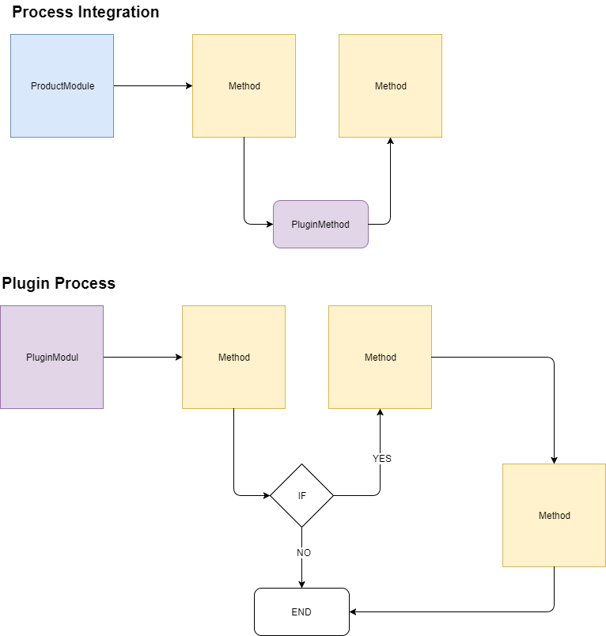

# LineTool1

## Versioning

|Branch|ProductVersion|Comment|
|---|
|v 1.0|8.0|New LineTool supporting ...|
|v 2.0| 9.0 | Upgraded to 9.0 ... |
|v 3.0| 9.0 | Added support for ... |

## Installation

- Copy File A to B
- Change Configuration Key "Key" in \path\subfolder\web.config to "Value"

## Process diagram

## Data flow diagramm (optional)

## Detailed description
